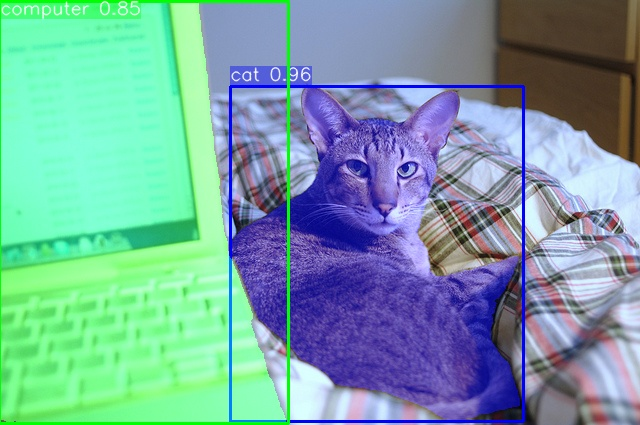
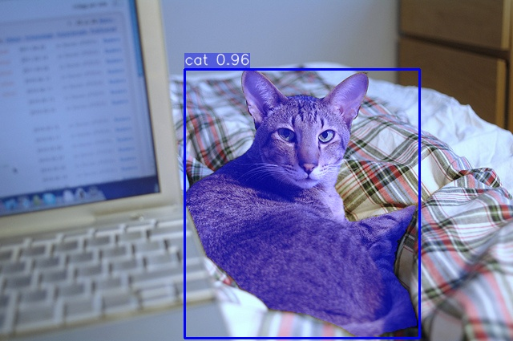
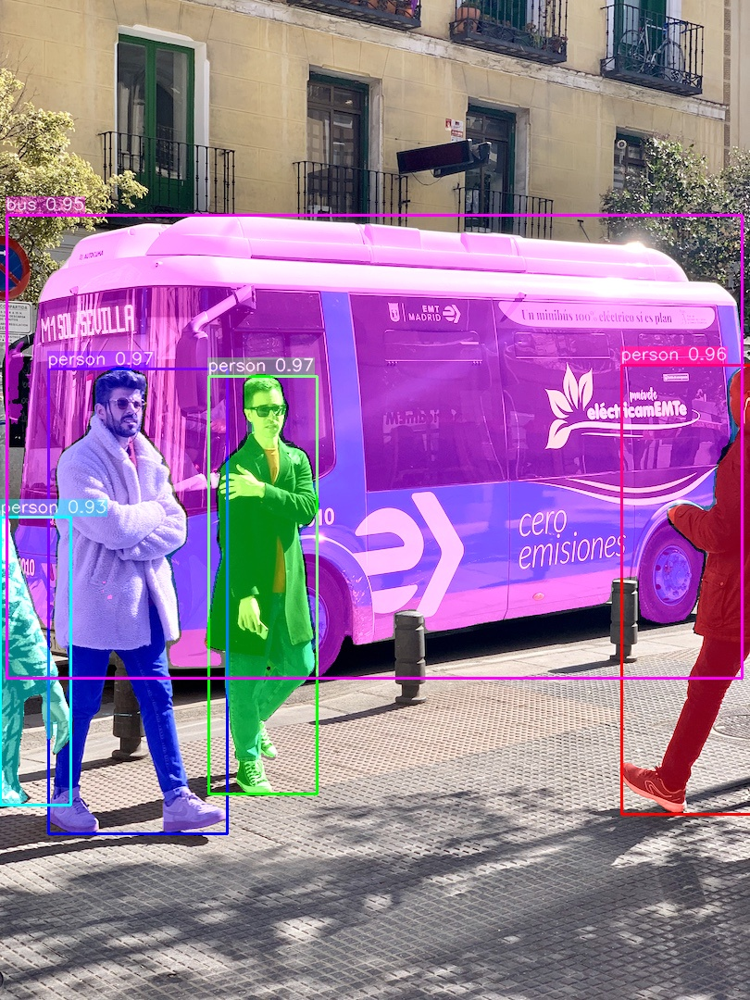
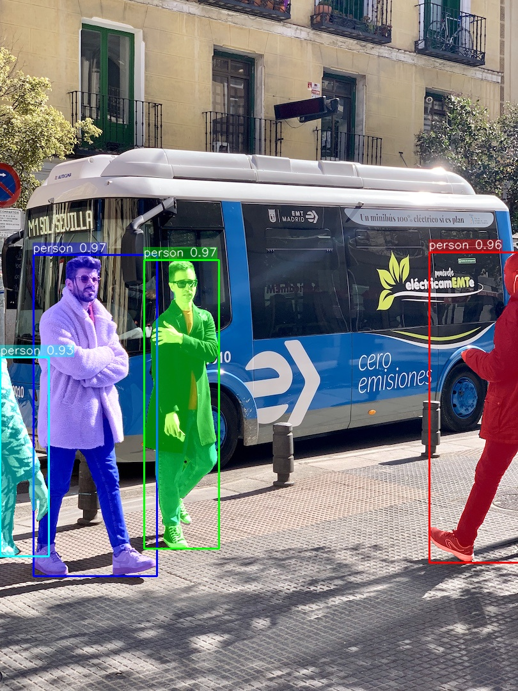
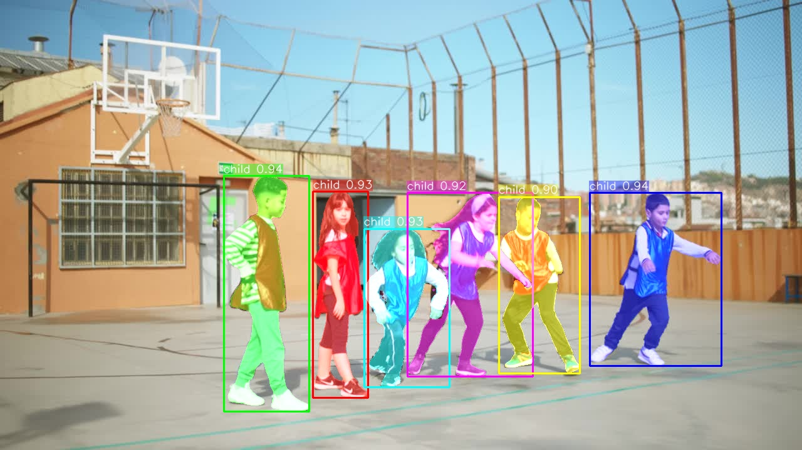
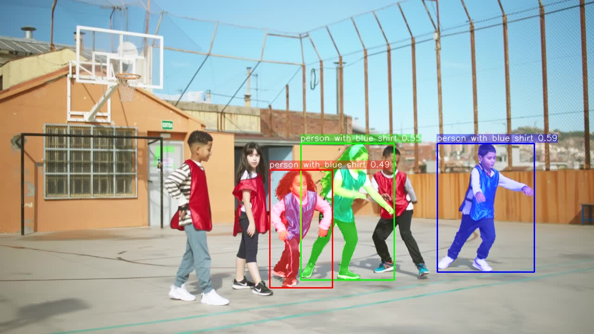

# SAM3 C++ 推理

本项目提供了 Segment Anything Model 3 ([SAM3](https://github.com/facebookresearch/sam3.git)) 的 C++ 实现，支持基于文本、点和框提示词的分割任务。使用 ONNX Runtime 进行推理，使用 OpenCV 进行图像处理和可视化。

## 效果

- 基于**文本**提示词

| 提示词 | 输出 | 提示词                        | 输出 |
|---------|---------|----------------------------|---------|
| **cat,computer** |  | **cat** |  |
| **person,bus** |  | **person** |  |
| **cushion** |  | **loveseat** |  |
| **child** |  | **person with blue shirt** |  |

- 基于**点**提示

| 提示点（**白色点**） | 输出                                                 |
| -------------------- | ---------------------------------------------------- |
| (558, 724)           |  |

- 基于**ROI框**提示

| 提示框（**白色框**） | 输出                                                |
| -------------------- | --------------------------------------------------- |
| [1276,484,1630,820]  |  |

## 功能特性
- **统一提示接口**: 通过命令行支持文本、交互式点击和边界框三种提示方式
- **多目标检测**: 正确识别和分割每个提示词对应的多个目标
- **增强可视化**: 实时掩码渲染，为每个目标分配不同颜色并显示置信度标签
- **GPU加速**: 可选的CUDA支持，实现更快的推理速度
- **可配置参数**: 控制检测阈值和最大结果数量

## 环境要求
- **C++ 编译器**: 支持 C++17 标准
- **OpenCV**: 版本 4.x
- **ONNX Runtime**: 版本 1.15+ (CPU或GPU版本位于 `3rdparty/` 目录) 
- **Python (仅用于导出)**: 需要 `ultralytics` 包进行 ONNX 导出
- **CUDA (可选)**: 需要自行安装 CUDA 并用于GPU加速

## 测试系统与硬件
- OS: Ubuntu22.04 
- GPU: NVIDIA GeForce RTX 2060
- CPU: Intel® Core™ i7-10700 CPU @ 2.90GHz × 16

## 环境安装

### 1. Python 环境 (用于模型导出)
```bash
conda create -n sam3_cpp python=3.10
conda activate sam3_cpp
pip install ultralytics onnx transformers
```
> 注意: [ultralytics](https://docs.ultralytics.com/zh/models/sam-3/) 包已包含 **SAM3** 模型的 python 端使用的一些库。
也可以通过 `pip install -U ultralytics` 安装最新版本的 **ultralytics** 包，确保其与 **SAM3** 模型兼容。

### 2. C++ 依赖
项目在 `3rdparty/` 目录中包含了预编译的 ONNX Runtime 库 (通过 `bash install_onnxruntime.sh` 脚本安装):
- `3rdparty/onnxruntime-cpu/` - CPU版本
- `3rdparty/onnxruntime-gpu/` - 支持CUDA的GPU版本
- `3rdparty/opencv/` - OpenCV库 (通过 `bash build_opencv.sh` 脚本安装)

## 模型准备 (PyTorch 转 ONNX)

在运行 C++ 推理引擎前，需要将 [SAM3 Pytorch 模型](https://drive.google.com/file/d/1zeiVSlAkVO4Tk2O-R7H3n1gYK2zi43Z3/view?usp=sharing) (参数量为 8,6123,5128个参数) 导出为 [ONNX](https://drive.google.com/drive/folders/1TrYTcESFMx46Q0D7rgo0NwJVw1I4jv1i?usp=sharing) 格式，并准备[分词器资源](https://drive.google.com/drive/folders/17_tnZ4Cu5t7Q0b9K1aFLAK_PTw4eXzpt?usp=sharing)。

```bash
# 1. 导出 ONNX 模型 (包含 Interactive 与 Grounding 管道)
python model/export_sam3_onnx.py

# 2. 导出分词器资源 (vocab.txt, merges.txt)
python model/export_tokenizer.py
```

有关导出脚本的详细参数说明、各个模型文件的具体作用以及兼容性补丁的说明，请参考：
👉 **[模型文件夹详细文档 (model/README.md)](./model/README.md)**

## Python 推理

你也可以运行 Python 推理脚本，使用原始 Ultralytics SAM3 模型实现进行对比测试或快速验证。

```bash
# 使用 sam3.pt 运行 Python 推理
conda run -n sam3_cpp python inference.py
```

## 编译和运行

### 使用CPU支持编译 (默认)
```bash
mkdir build && cd build
cmake ..
make -j$(nproc)
```

### 使用GPU支持编译
```bash
mkdir build && cd build
cmake -DUSE_GPU=ON ..
make -j$(nproc)
```

## 使用方法

### 命令行接口

```bash
./sam3_inference [选项]

选项:
  --image <路径>          输入图像路径 (必需)
  --output <路径>         输出图像路径 (默认: result.jpg)
  --mode <类型>           提示模式: texts|points|boxes (默认: texts)
  --prompt <值>           提示值:
                          - texts: 文本字符串 (例如: 'person')
                          - points: x,y坐标 (例如: '100,200')
                          - boxes: x1,y1,x2,y2坐标 (例如: '100,100,200,200')
  --label <名称>          点或框的类别标签 (默认: 'object')
  --threshold <值>        置信度阈值 (默认: 0.25)
  --max-detections <数量> 最大检测数量 (默认: 0 = 无限制)
  --gpu                   使用GPU加速 (如果可用)
  --help                  显示帮助信息
```

### 使用示例

**基于[文本]的单类别分割:**

```bash
./sam3_inference --image ../assets/i1.png --mode texts --prompt "cat" --max-detections 1 --output i1_cat_result.jpg
```

**基于[文本]的多类别分割:**

```bash
./sam3_inference --image ../assets/i1.png --mode texts --prompt "cat,computer" --max-detections 5 --output i1_cat_computer_result.jpg
```

**基于[点]的分割 (自定义标签):**

```bash
./sam3_inference --image ../assets/i3.png --mode points --prompt "558,724" --label "pillow" --output i3_point_pillow.jpg
```

**基于[框]的分割 (自定义标签和阈值):**

```bash
./sam3_inference --image ../assets/i3.png --mode boxes --prompt "1276,484,1630,820" --label "potting" --output i3_box_potting.jpg
```

**限制结果数量并使用GPU:**
```bash
./sam3_inference --image ../assets/i4.png --mode texts --prompt "child" --max-detections 10 --threshold 0.4 --gpu --output i4_child_result.jpg
```